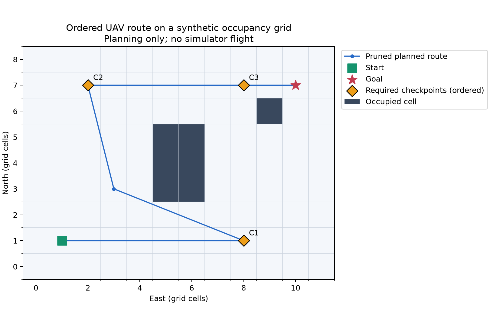
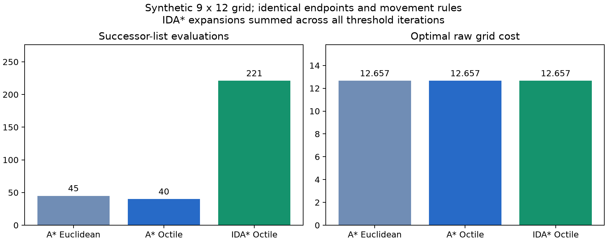

# UAV Motion Planning

This project implements grid-based motion planning for autonomous UAV navigation using A*, IDA*, heuristic comparison and routes through ordered checkpoints. Standalone planning examples run without a drone SDK or simulator.

The planner converts obstacle data into a fixed-altitude occupancy grid, applies collision-aware search, and prunes paths into waypoints while retaining required checkpoints. Euclidean and Octile heuristics can be compared under the same movement rules. An optional controller connects the route to a Udacity simulator, checks the complete plan before takeoff and records sampled checkpoint visits. The repository separates synthetic benchmarks and automated software checks from unverified flight behavior. Starter code, coursework development and later maintenance are described separately below.
## Features

- A* with improved-cost relaxation, stale-entry handling and closed-node reopening.
- IDA* with increasing f-cost thresholds, explicit DFS frames and cycle prevention.
- Euclidean and Octile heuristics on an eight-direction grid.
- Inflated obstacles, diagonal corner guards and conservative waypoint pruning.
- Ordered checkpoint planning with separate grid cost and pruned route distance.
- An optional simulator controller with preflight route checks and sampled visit logs.

## Implementation

```text
Occupancy grid -> Search -> Path pruning -> Waypoints -> Mission controller
                   |                          |
            Standalone examples       Optional simulator SDK
```

`src/planning_utils.py` is independent of `udacidrone`. Movement costs are 1 and sqrt(2); Octile distance is the obstacle-free lower bound for this model. Each checkpoint segment is searched and pruned separately so its endpoints remain in the route.

A* uses `f = g + h`; reopening supports admissible but inconsistent heuristics. IDA* raises its threshold to the smallest exceeded f-cost and uses ancestor-context dominance keys. Its transposition table can grow exponentially, so this implementation does not claim linear memory usage. [Algorithm notes](docs/algorithm_notes.md) cover the search and conservative supercover visibility checks.

[Mission configuration](config/mission.json) sets altitude, safety margin, checkpoints and acceptance radii. Default local checkpoints are `(20, 30)`, `(40, -5)` and `(60, 30)`. Route shaping is optional; `auto_reverse` can reverse the mission based on launch position.

## Recorded results



On the deterministic 9×12 synthetic map, direct search runs from `(1, 1)` to `(7, 10)`:

| Method | Grid cost | Expanded nodes | Raw nodes | Pruned waypoints |
| --- | ---: | ---: | ---: | ---: |
| A* Euclidean | 12.656854 | 45 | 12 | 3 |
| A* Octile | 12.656854 | 40 | 12 | 3 |
| IDA* Octile | 12.656854 | 221 | 12 | 4 |

The synthetic checkpoint route through `(1, 8)`, `(7, 2)` and `(7, 8)` has grid cost **25.242641** and pruned distance **24.508270**. These points differ from the simulator mission configuration.



[Benchmark CSV](assets/benchmark.csv) and [environment metadata](assets/benchmark.json) retain the measurements. Expanded nodes count successor evaluations, excluding goals and stale queue entries; IDA* includes all thresholds. Timings are single samples, not a stable performance ranking.

Offline checks on the private simulator map returned cost **161.213203** for all three methods; [map benchmark records](assets/benchmark_colliders.csv) and [input metadata](assets/benchmark_colliders.json) are included, but the map is external. Historical coursework expansion counts differ from these later runs, as explained in [testing and benchmark notes](docs/validation_report.md).

## Getting started

From the repository root:

```bash
python -m venv .venv
# PowerShell: .\.venv\Scripts\Activate.ps1
# macOS/Linux: source .venv/bin/activate
python -m pip install -r requirements-dev.txt
python -m examples.standalone_demo
python -m examples.benchmark
python -m pytest -q -ra
```

The recorded standalone environment used Python 3.14.6, NumPy 2.4.6, Matplotlib 3.11.0 and pytest 9.0.3 on Windows; a fresh installation was not independently validated. To benchmark an authorized external map:

```bash
python -m examples.benchmark --map /path/to/colliders.csv --start 0 0 --goal 155 -15 --output assets/benchmark_colliders.csv
```

For the optional simulator, follow the separate [legacy SDK setup](docs/simulator_setup.md), start a compatible simulator, then run:

```bash
python -m src.motion_planning --map /path/to/colliders.csv --config config/mission.json --host 127.0.0.1 --port 5760
```

Preflight validates the full route before takeoff. Required visits use measured horizontal position and altitude; overshoot alone is insufficient. Final arrival also requires low horizontal speed. Sampled visits are written to `Logs/checkpoint_visits.json` after disarming.

## Testing

The suite checks endpoints, unreachable goals, diagonal movement, heuristics, checkpoint order, pruning and mocked controller behavior. Independent Dijkstra and closed-square intersection checks serve as references, including all 512 obstacle masks of a 3×3 grid and a long-corridor IDA* case.

Earlier recorded results are **106 passed, 1 skipped** with the external map, and **101 passed, 6 skipped** without it. [Saved test results](assets/test_results.json) and [testing notes](docs/validation_report.md) describe the environment and exclusions. They are not claims that the full suite was rerun during this cleanup. Optional offline-map checks use `UAV_COLLIDERS_CSV`; live connectivity uses `UAV_SIMULATOR_CONNECTIVITY=1`. Connectivity and mocked tests do not validate a flight.

The earlier Windows run disabled unrelated pytest plugins after runtime errors:

```powershell
$env:PYTEST_DISABLE_PLUGIN_AUTOLOAD = '1'
python -m pytest -q -ra -p no:debugging
```

## Project Background

This project was developed as my individual coursework assignment using the provided Udacity motion-planning starter framework, with AI assistance during development. I was responsible for completing and submitting the assignment.

## My Work and Contributions

I worked with the provided framework to implement, integrate, debug and test the planning workflow. The repository includes grid-based search algorithms, planning utilities, simulator integration and supporting tests. Some components came from starter code or were developed with AI assistance; these features are not a claim that every algorithm or line of code was written independently from scratch.

## AI Assistance

AI tools assisted with parts of the coding, debugging and technical explanations during development. Later maintenance, regression tests, synthetic examples and documentation also used AI coding assistance. The available records do not identify exact assistance boundaries for every component.

## Starter Code and Attribution

The planning scaffold, drone lifecycle, callbacks and simulator display protocol build on the [Udacity Flying Car and Autonomous Flight Engineer (FCND) Motion Planning starter framework](https://github.com/udacity/FCND-Motion-Planning). The [UdaciDrone SDK](https://github.com/udacity/udacidrone) is a separate third-party dependency and is not bundled.

[Background and source notes](docs/contribution_verification.md) distinguish assignment responsibility from the origins of specific components. [Maintenance notes](docs/project_audit.md) retain the earlier implementation changes. No project-wide license is assigned while coursework sharing permission and derivative-code rights remain unresolved. Private reports, personal identifiers and the simulator map are excluded.

## Limitations

Planning uses a fixed-altitude 2D grid. Graph-optimal paths and conservative pruning do not guarantee a globally shortest continuous route or safe tracked flight. IDA* can use substantial time and memory. The legacy SDK environment failed to initialize during the earlier checks; live simulator compatibility, actual checkpoint traversal and landing remain unverified. No flight screenshot is included.
